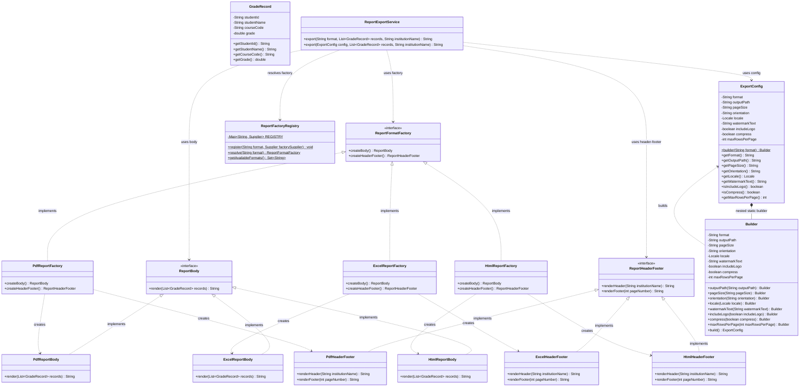

# Post-contenido — Unidad 2: Patrones Creacionales

* **Estudiante:** Alex Rodríguez
* **Proyecto:** Exportador de Reportes Académicos (`exportador-reportes`)
* **Materia:** Patrones de Diseño de Software
* **Lenguaje & Versión:** Java 17 (Maven)

---

## 1. Descripción del Proyecto y Arquitectura

El **Exportador de Reportes Académicos** es un sistema modular diseñado para generar reportes institucionales de calificaciones en múltiples formatos (PDF, Excel, HTML, entre otros). Su arquitectura desacopla por completo la definición del contenido académico de las reglas de renderizado, presentación visual y configuración de exportación.

El diseño del sistema aborda dos problemas clásicos del desarrollo de software empresarial:
1. **La proliferación de clases y el acoplamiento a formatos concretos**, resuelto mediante la coordinación de familias de productos afines.
2. **La complejidad en la parametrización de salidas**, resuelta mediante la construcción fluida de objetos de configuración inmutables con validación de invariantes de negocio.

---

## 2. Diagrama de Clases (Arquitectura del Sistema)



---

## 3. Análisis Técnico de los Patrones de Diseño Aplicados

### 3.1. Abstract Factory (Fábrica Abstracta)
* **Propósito:** Proporcionar una interfaz única para la creación coordinada de familias de objetos relacionados o dependientes (`ReportBody` y `ReportHeaderFooter`) sin especificar sus clases concretas.
* **Justificación en el Proyecto:** Un reporte consta de dos elementos visuales fuertemente acoplados por el formato destino: el encabezado/pie de página y el cuerpo del documento. Mezclar un encabezado HTML con un cuerpo de tabla PDF generaría un documento corrupto o inconsistente. El patrón **Abstract Factory** garantiza la coherencia entre familias de productos (`PdfReportFactory` crea exclusivamente `PdfReportBody` y `PdfHeaderFooter`).
* **Estructura:**
  * **Productos Abstractos:** `ReportBody`, `ReportHeaderFooter`.
  * **Productos Concretos:** `PdfReportBody`, `PdfHeaderFooter`, `ExcelReportBody`, `ExcelHeaderFooter`, `HtmlReportBody`, `HtmlHeaderFooter`.
  * **Fábrica Abstracta:** `ReportFormatFactory`.
  * **Fábricas Concretas:** `PdfReportFactory`, `ExcelReportFactory`, `HtmlReportFactory`.

### 3.2. Builder (Constructor)
* **Propósito:** Separar la construcción de un objeto complejo de su representación final, permitiendo que el mismo proceso de construcción cree diferentes configuraciones de forma legible y segura.
* **Justificación en el Proyecto:** La clase `ExportConfig` posee 1 atributo obligatorio (`format`) y 8 atributos opcionales (`outputPath`, `pageSize`, `orientation`, `locale`, `watermarkText`, `includeLogo`, `compress`, `maxRowsPerPage`). Usar constructores sobrecargados conllevaría al anti-patrón *Telescoping Constructor*. El Builder ofrece una API fluida y centraliza la validación de invariantes de negocio antes de retornar un objeto inmutable:
  * **Invariante 1:** `compress == true` exige obligatoriamente un `outputPath` definido; de lo contrario lanza `IllegalStateException("compress=true requiere especificar outputPath: no se puede comprimir un resultado en memoria")`.
  * **Invariante 2:** `maxRowsPerPage` debe ser estrictamente mayor a 0; de lo contrario lanza `IllegalStateException("maxRowsPerPage debe ser mayor que 0")`.
  * **Validación de Constructor:** `format` no puede ser nulo ni estar en blanco (lanza `IllegalArgumentException`).

### 3.3. Registry / Dynamic Factory (Principio Abierto/Cerrado — OCP)
* **Propósito:** Desacoplar al cliente de la instanciación estática mediante un mapa de proveedores perezosos (`Supplier<ReportFormatFactory>`).
* **Justificación en el Proyecto:** La clase `ReportFactoryRegistry` encapsula el registro dinámico de fábricas. Permite agregar nuevos formatos (por ejemplo, Markdown, CSV, XML o JSON) en tiempo de ejecución mediante `ReportFactoryRegistry.register(format, supplier)` sin necesidad de modificar el código existente de `ReportExportService` ni alterar sentencias condicionales `switch/case` o `if/else`, cumpliendo rigurosamente el **Principio Abierto/Cerrado (Open/Closed Principle)**.

---

## 4. Principios SOLID Demostrados

| Principio | Aplicación en el Proyecto |
| :--- | :--- |
| **S - Single Responsibility** | Cada clase tiene una única responsabilidad: `GradeRecord` modela datos, `PdfReportBody` renderiza tablas PDF, `ExportConfig.Builder` valida e instancia configuraciones, y `ReportExportService` orquesta la exportación. |
| **O - Open/Closed** | `ReportFactoryRegistry` y `ReportFormatFactory` permiten extender el sistema a nuevos formatos de reporte sin modificar las clases de servicio ni los contratos existentes. |
| **L - Liskov Substitution** | Cualquier implementación concreta de `ReportFormatFactory` (PDF, Excel, HTML, Markdown) puede ser utilizada indistintamente por el cliente sin alterar el comportamiento esperado del contrato. |
| **I - Interface Segregation** | Las interfaces `ReportBody` y `ReportHeaderFooter` están segregadas en contratos específicos en lugar de una interfaz monolítica de renderizado. |
| **D - Dependency Inversion** | `ReportExportService` depende de las abstracciones `ReportFormatFactory`, `ReportBody` y `ReportHeaderFooter`, nunca de clases concretas como `PdfReportFactory` o `ExcelReportBody`. |

---

## 5. Instrucciones de Compilación y Ejecución

### Prerrequisitos
* Java Development Kit (JDK) 17 o superior.
* Apache Maven 3.8+.

### Pasos de Ejecución

1. Clonar o ubicarse en la carpeta raíz del proyecto:
```bash
cd exportador-reportes
```

2. Limpiar y compilar el proyecto:
```bash
mvn clean compile
```

3. Ejecutar las pruebas unitarias automatizadas:
```bash
mvn test
```

4. Ejecutar la demostración principal (`Main.java`):
```bash
mvn exec:java -Dexec.mainClass="com.patrones.u2.Main"
```

---

## 6. Salida de la Demostración (`Main.java`)

La ejecución del programa principal demuestra cinco escenarios clave:

```text
================================================================================
   DEMOSTRACIÓN DE PATRONES CREACIONALES — UNIDAD 2 (Alex Rodríguez)           
   Patrones: Abstract Factory | Builder | Registry (OCP)                        
================================================================================

>>> 1. EXPORTACIÓN EN FORMATOS BASE (PDF, EXCEL, HTML) <<<

--- [1.1 FORMATO PDF] ---
===============================================================================
 [PDF HEADER] %PDF-1.7 (Documento Académico Oficial)
 INSTITUCIÓN : UNIVERSIDAD DE SANTANDER (UDES)
 EMISIÓN     : 2026-08-30 11:55:00 -06:00
 SEGURIDAD   : FIRMA DIGITALIZADA / VERIFICACIÓN SHA-256
===============================================================================
+-----------------------------------------------------------------------------+
| [PDF CONTENT STREAM] - LISTADO OFICIAL DE CALIFICACIONES                   |
+------------+--------------------------------+------------+------------------+
| CÓDIGO     | NOMBRE DEL ESTUDIANTE          | ASIGNATURA | NOTA / ESTADO    |
+------------+--------------------------------+------------+------------------+
| EST-101    | Alex Rodríguez                 | CS-201     | 95.50 (APROBADO) |
| EST-102    | Valeria Gómez                  | CS-201     | 88.00 (APROBADO) |
| EST-103    | Carlos Mendoza                 | CS-201     | 52.00 (REPROB..  |
| EST-104    | Sofía Fernández                | CS-201     | 79.50 (APROBADO) |
| EST-105    | Diego Morales                  | CS-201     | 45.00 (REPROB..  |
| EST-106    | Lucía Navarro                  | CS-201     | 91.00 (APROBADO) |
+------------+--------------------------------+------------+------------------+
| TOTAL REGISTROS: 6    | PROMEDIO: 75.17 | APROBADOS: 4   | REPROBADOS: 2   |
+-----------------------------------------------------------------------------+
-------------------------------------------------------------------------------
 [PDF FOOTER] Página 1 | Validez académica garantizada por el Consejo Directivo
===============================================================================

--- [1.2 FORMATO EXCEL] ---
[EXCEL_CONFIG_PAGINA: ENCABEZADO]
&L&"Arial,Negrita"Universidad de Santander (UDES)	&C&"Arial,Normal"REPORTE DE RENDIMIENTO ACADÉMICO	&R&D - &T
[HOJA_EXCEL: Calificaciones_Consolidadas]
A1:ID_ESTUDIANTE	B1:NOMBRE_COMPLETO	C1:COD_ASIGNATURA	D1:CALIFICACION	E1:ESTADO
A2:EST-101	B2:"Alex Rodríguez"	C2:CS-201	D2:95.50	E2:=SI(D2>=60;"APROBADO";"REPROBADO")
A3:EST-102	B3:"Valeria Gómez"	C3:CS-201	D3:88.00	E3:=SI(D3>=60;"APROBADO";"REPROBADO")
A4:EST-103	B4:"Carlos Mendoza"	C4:CS-201	D4:52.00	E4:=SI(D4>=60;"APROBADO";"REPROBADO")
A5:EST-104	B5:"Sofía Fernández"	C5:CS-201	D5:79.50	E5:=SI(D5>=60;"APROBADO";"REPROBADO")
A6:EST-105	B6:"Diego Morales"	C6:CS-201	D6:45.00	E6:=SI(D6>=60;"APROBADO";"REPROBADO")
A7:EST-106	B7:"Lucía Navarro"	C7:CS-201	D7:91.00	E7:=SI(D7>=60;"APROBADO";"REPROBADO")
A8:TOTAL_FILAS	B8:=CONTAR(D2:D7)	C8:PROMEDIO_GENERAL	D8:=PROMEDIO(D2:D7)	E8:---
[EXCEL_CONFIG_PAGINA: PIE_PAGINA]
&L&F (Libro de Calificaciones)	&C&"Arial,Cursiva"Confidencial	&RPágina 1 de &N

--- [1.3 FORMATO HTML] ---
<!DOCTYPE html>
<html lang="es">
<head>
  <meta charset="UTF-8">
  <meta name="viewport" content="width=device-width, initial-scale=1.0">
  <title>Reporte Académico - Universidad de Santander (UDES)</title>
</head>
<body style="font-family: Arial, sans-serif; margin: 20px; color: #1e293b;">
<header class="report-header" style="border-bottom: 2px solid #1e3a8a; padding-bottom: 12px; margin-bottom: 20px;">
  <h1 style="color: #1e3a8a; margin: 0; font-size: 24px;">Universidad de Santander (UDES)</h1>
  <p style="color: #64748b; margin: 4px 0 0 0; font-size: 14px;">Reporte Oficial Consolidado de Notas | Generado: 2026-08-30 11:55</p>
</header>
<main class="report-main-content">
  <table class="grades-table" style="width:100%; border-collapse:collapse; font-family:sans-serif;">
    <thead>
      <tr style="background-color:#1e3a8a; color:#ffffff;">
        <th style="padding:8px; border:1px solid #cbd5e1; text-align:left;">ID Estudiante</th>
        <th style="padding:8px; border:1px solid #cbd5e1; text-align:left;">Nombre del Estudiante</th>
        <th style="padding:8px; border:1px solid #cbd5e1; text-align:left;">Curso</th>
        <th style="padding:8px; border:1px solid #cbd5e1; text-align:right;">Calificación</th>
        <th style="padding:8px; border:1px solid #cbd5e1; text-align:center;">Estado</th>
      </tr>
    </thead>
    <tbody>
      <tr style="border-bottom:1px solid #e2e8f0;">
        <td style="padding:8px; border:1px solid #cbd5e1;">EST-101</td>
        <td style="padding:8px; border:1px solid #cbd5e1;">Alex Rodríguez</td>
        <td style="padding:8px; border:1px solid #cbd5e1;">CS-201</td>
        <td style="padding:8px; border:1px solid #cbd5e1; text-align:right;">95.50</td>
        <td style="padding:8px; border:1px solid #cbd5e1; text-align:center;"><span style="background-color:#dcfce7; color:#166534; padding:3px 8px; border-radius:4px; font-weight:bold;">APROBADO</span></td>
      </tr>
      ...
    </tbody>
    <tfoot>
      <tr style="background-color:#f1f5f9; font-weight:bold;">
        <td colspan="3" style="padding:8px; border:1px solid #cbd5e1;">Total Estudiantes: 6</td>
        <td colspan="2" style="padding:8px; border:1px solid #cbd5e1; text-align:right;">Promedio General: 75.17</td>
      </tr>
    </tfoot>
  </table>
</main>
<footer class="report-footer" style="margin-top: 30px; padding-top: 10px; border-top: 1px solid #cbd5e1; font-size: 12px; color: #64748b; display: flex; justify-content: space-between;">
  <span>Documento emitido por el Sistema de Información Académica</span>
  <span>Página 1</span>
</footer>
</body>
</html>

================================================================================
>>> 2. EXPORTACIÓN CON ExportConfig (VALORES POR DEFECTO) <<<

Configuración construida: ExportConfig{format='PDF', outputPath='null', pageSize='A4', orientation='PORTRAIT', locale=es_CO, watermarkText='null', includeLogo=false, compress=false, maxRowsPerPage=50}

================================================================================
>>> 3. EXPORTACIÓN CON ExportConfig PERSONALIZADA (Letter, Landscape, Watermark, etc.) <<<

Configuración personalizada construida:
  * Formato: PDF
  * OutputPath: /var/reports/calificaciones_2026_u2.pdf
  * PageSize: LETTER
  * Orientation: LANDSCAPE
  * Locale: es-CO
  * WatermarkText: COPIA NO OFICIAL - AUDITORÍA
  * IncludeLogo: true
  * Compress: true
  * MaxRowsPerPage: 4

[METADATOS DE IMPRESIÓN | Tamaño: LETTER | Orientación: LANDSCAPE | Idioma: es-CO | Logo: SÍ | MáxFilas/Pág: 4]
===============================================================================
 [PDF HEADER] %PDF-1.7 (Documento Académico Oficial)
 INSTITUCIÓN : UNIVERSIDAD DE SANTANDER (UDES)
 EMISIÓN     : 2026-08-30 11:55:00 -06:00
 SEGURIDAD   : FIRMA DIGITALIZADA / VERIFICACIÓN SHA-256
===============================================================================
>>> MARCA DE AGUA: [ COPIA NO OFICIAL - AUDITORÍA ] <<<
+-----------------------------------------------------------------------------+
| [PDF CONTENT STREAM] - LISTADO OFICIAL DE CALIFICACIONES                   |
+------------+--------------------------------+------------+------------------+
...
-------------------------------------------------------------------------------
 [PDF FOOTER] Página 2 | Validez académica garantizada por el Consejo Directivo
===============================================================================
[DESTINO DE EXPORTACIÓN]: Archivo generado en -> /var/reports/calificaciones_2026_u2.pdf (Compresión GZIP/ZIP habilitada)

================================================================================
>>> 4. VALIDACIÓN DE INVARIANTES EN BUILDER (Manejo de Errores Controlado) <<<

Intentando construir ExportConfig con compress=true pero sin outputPath...
 Excepción capturada exitosamente (Invariante 1):
   Tipo: IllegalStateException
   Mensaje: "compress=true requiere especificar outputPath: no se puede comprimir un resultado en memoria"

Intentando construir ExportConfig con maxRowsPerPage = -5...
 Excepción capturada exitosamente (Invariante 2):
   Tipo: IllegalStateException
   Mensaje: "maxRowsPerPage debe ser mayor que 0"

Intentando construir ExportConfig con format nulo...
 Excepción capturada exitosamente (Validación Formato):
   Tipo: IllegalArgumentException
   Mensaje: "El formato es obligatorio y no puede ser nulo ni vacío."

================================================================================
>>> 5. EXTENSIBILIDAD OCP: REGISTRO DINÁMICO DE UN NUEVO FORMATO (MARKDOWN) <<<

Formatos disponibles antes de la extensión: [EXCEL, HTML, PDF]
Formatos disponibles después del registro: [EXCEL, HTML, MARKDOWN, PDF]

--- [EXPORTACIÓN EN FORMATO EXTENDIDO 'MARKDOWN'] ---
# Universidad de Santander (UDES)
## Reporte de Calificaciones (Markdown)

| ID | Estudiante | Asignatura | Nota | Estado |
|---|---|---|---|---|
| `EST-101` | Alex Rodríguez | CS-201 | 95.50 | **Aprobado** |
| `EST-102` | Valeria Gómez | CS-201 | 88.00 | **Aprobado** |
| `EST-103` | Carlos Mendoza | CS-201 | 52.00 | *Reprobado* |
| `EST-104` | Sofía Fernández | CS-201 | 79.50 | **Aprobado** |
| `EST-105` | Diego Morales | CS-201 | 45.00 | *Reprobado* |
| `EST-106` | Lucía Navarro | CS-201 | 91.00 | **Aprobado** |

---
*Página 1 | Generado vía Extensión OCP*

================================================================================
   DEMOSTRACIÓN FINALIZADA CON ÉXITO
================================================================================
```